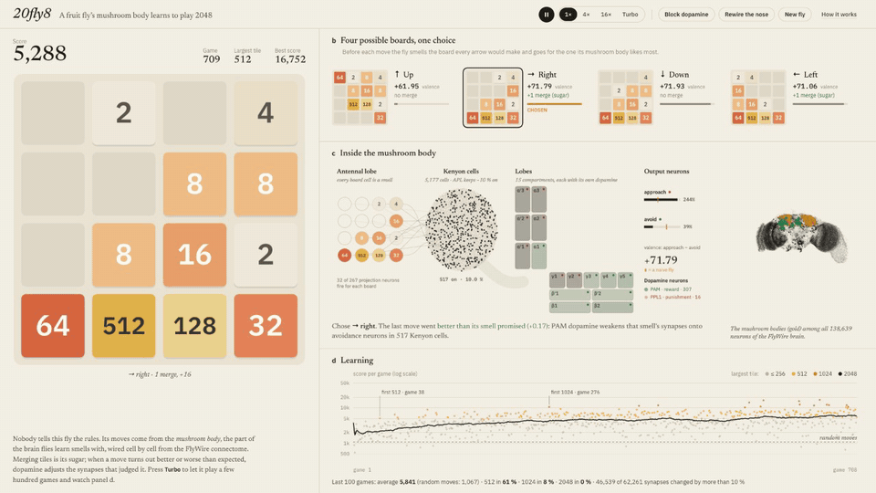
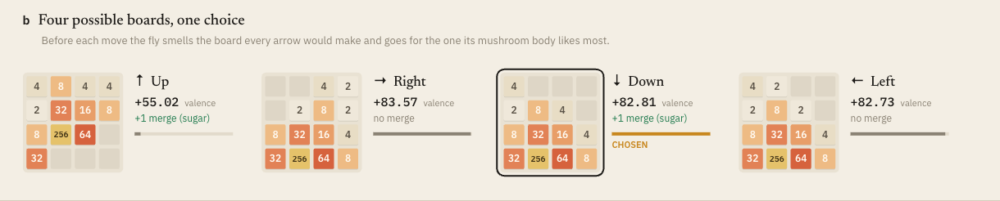
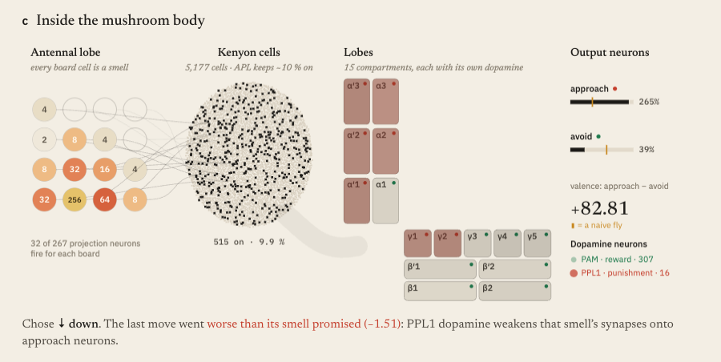
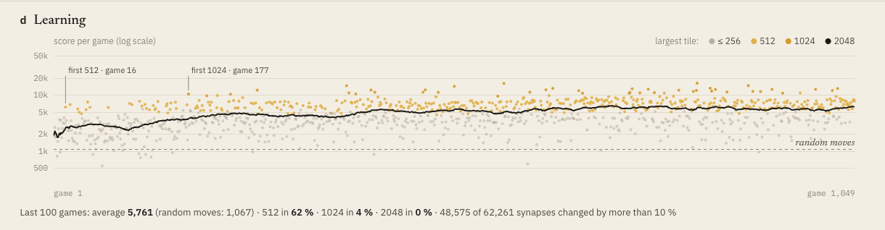
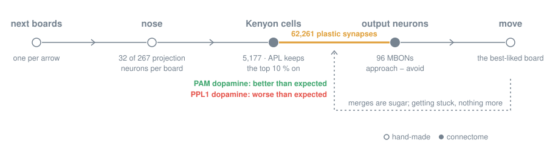

<div align="center">

# 20fly8

**A fruit fly's mushroom body learns to play 2048, live in your browser.**

Real FlyWire wiring · 5,177 Kenyon cells · 62,261 plastic synapses · dopamine as the only teacher

### [Watch it learn →](https://dtecx.github.io/20fly8/)

[](https://github.com/dtecx/20fly8/actions/workflows/pages.yml)

-c8871e)




</div>

Flies learn which smells mean food in a part of the brain called the **mushroom body**. A smell switches on a few
projection neurons; each of the ~5,000 Kenyon cells listens to a handful of them and fires only when enough agree, so
every smell gets its own sparse set of cells. Those cells talk to a few dozen output neurons that push the fly towards
a smell or away from it, and dopamine neurons decide which of those synapses to weaken.

20fly8 builds that circuit from the [FlyWire](https://flywire.ai) connectome, neuron by neuron, and gives it a 2048 board
to smell. Nobody tells it the rules. Merging tiles is sugar. A naive fly plays only a little better than random
button-mashing; a few hundred games later its synapses have learned which boards smell promising, and after a few
thousand it scores six times as much.

This is the learning sequel to [Doodle Fly](https://github.com/dtecx/doodle-fly), where the whole brain steers a jumping
game with no learning at all.

## What you're looking at

<table>
  <tr>
    <td colspan="2"></td>
  </tr>
  <tr>
    <td colspan="2"><b>b · Four possible boards, one choice.</b> Before every move the fly smells the board each arrow would
    make. Its mushroom body gives each one a <i>valence</i>; merges add sugar; it goes for the best.</td>
  </tr>
  <tr>
    <td width="58%"></td>
    <td width="42%"></td>
  </tr>
  <tr>
    <td valign="top"><b>c · Inside the mushroom body.</b> The chosen board as a smell in the antennal lobe, the ~10 % of
    Kenyon cells it turns on, the 15 lobe compartments (each marked with the dopamine it gets) and the approach and
    avoidance output neurons, drawn against where a naive fly would be. Dopamine washes over its compartments when it
    fires, and a sentence underneath says what just changed.</td>
    <td valign="top"><b>d · Learning.</b> The score of every game, coloured by its largest tile, the running mean, random
    play for comparison, and the first 512, 1024 and 2048. The inset beside the circuit shows where the mushroom bodies
    sit among all 138,639 neurons of the brain.</td>
  </tr>
</table>

## How it learns



1. **Smell.** Each of the 16 cells, with its tile, switches on one projection neuron per side of the brain: 32 of the
   267 that reach the Kenyon cells. The left antennal lobe tells small tiles apart (2 … 64, then "128 or more"), the
   right one big tiles (32 … 512, then "1024 or more"). This "nose" is the one hand-made sensory interface.
2. **Kenyon cells.** From here on the wiring is FlyWire v783: 27,502 projection-neuron → Kenyon-cell connections. Each
   cell sums the synapses of its active inputs; the APL neuron's feedback inhibition is modelled as letting the top
   10 % of each side fire, harder the further above threshold.
3. **Output neurons.** 62,261 Kenyon-cell → output-neuron connections, starting at their synapse counts. Which
   dopamine reaches each output neuron is read from the connectome too: 51 sit in compartments of the PPL1
   (punishment) neurons and drive approach, 41 in compartments of the PAM (reward) neurons and drive avoidance.
   *Valence* = approach − avoidance.
4. **Choice.** For each of the four moves: the sugar it would bring now plus the valence of the board it leaves.
   The fly takes the largest, like a fly picking an arm of a four-way maze.
5. **Dopamine.** After the next move the program compares what that choice promised with what came: sugar plus the
   next board's valence. Better than expected, the PAM neurons fire and weaken the avoidance synapses of the Kenyon
   cells that smelled it; worse, the PPL1 neurons weaken the approach ones; a pause below their resting rate does the
   opposite. When the game is stuck, nothing more comes. Every one of these is the dopamine rule measured in flies
   ([Hige et al. 2015](https://doi.org/10.1016/j.neuron.2015.11.003)), and together they are temporal-difference
   learning of how good a board is, the method that taught computers 2048 (Szubert & Jaśkowski 2014).

## Is it really learning?

[`scripts/eval.ts`](scripts/eval.ts), 500 games per condition (1,000 for random), synapses frozen during the test:

| condition | mean score | reaches 512 | reaches 1024 | best tile |
|---|:---:|:---:|:---:|:---:|
| random moves | 1,103 | 0 % | 0 % | 256 |
| naive fly, connectome strengths | 1,594 | 1 % | 0 % | 512 |
| **trained fly, after 3,000 games** | **6,986** | **75 %** | **15 %** | **1024** |
| trained fly, nose rewired | 925 | 0 % | 0 % | 256 |
| trained fly, synapses shuffled | 1,287 | 0 % | 0 % | 256 |

Rewire the nose, so every smell reaches different projection neurons, and the trained fly drops below random: what it
learned is tied to particular smells. Shuffle its learned synapses among themselves and it is back to naive: the
knowledge sits in which synapse changed, not in how much changed overall. Over training the mean score climbs
3,584 → 4,768 → 5,741 → … → 6,974 per 250 games. While it keeps learning it occasionally reaches 2048. Both controls
are buttons on the page (**Rewire the nose**, **Block dopamine**), so you can try them on a fly you trained yourself.

## Why not the spiking whole brain from Doodle Fly?

That was the first plan, and the numbers said no. In the leaky integrate-and-fire model of
[Shiu et al. 2024](https://www.nature.com/articles/s41586-024-07763-9), which treats every neuron as a single point:

- driving 16 projection neurons per side lights up the whole antennal lobe: 529 more projection neurons fire;
- 70–78 % of all Kenyon cells fire for any input, and two unrelated smells give the same pattern (cosine 0.99), so
  there is no sparse code to learn with. Kenyon cells excite each other through axo-axonal synapses in the lobes,
  which a point neuron cannot tell apart from inputs;
- clamping the projection neurons and dropping those synapses does give a sparse code, but a noisy one (cosine 0.6
  between repeats of the same smell in 50 ms) at about real time, while the fly needs four smells per move and
  thousands of games.

So the circuit runs as a firing-rate model on the same wiring: one pass per smell, about 5,000 moves a second in a
Web Worker. That speed is what makes learning watchable.

## What's real and what's engineered

| part | status |
|---|---|
| who connects to whom (PN → KC → MBON), synapse counts | FlyWire v783, unchanged |
| which output neurons get reward and which punishment dopamine | read from the DAN → MBON synapses |
| approach vs avoidance per compartment | the mushroom-body logic of Aso et al. 2014 |
| dopamine weakens the active cells' synapses in its compartment | measured in flies; here also strengthening on dopamine pauses |
| sparse Kenyon-cell code | top 10 % per side, a stand-in for APL's feedback inhibition |
| board → projection neurons, sugar = merges, picking a move | hand-made interfaces |
| reward-prediction error | computed by the program (the MBON → DAN loops that could compute it are in the connectome, not simulated) |
| neuron dynamics | firing rates, no spikes or time constants |

The brain is female and brain-only. It's a toy built on real data, not an uploaded fly.

## Run it locally

Needs Node ≥ 22.18 and, for the one-time data step, [uv](https://docs.astral.sh/uv/) (or Python ≥ 3.11 with numpy,
pandas and pyarrow).

```bash
git clone https://github.com/dtecx/20fly8
cd 20fly8
npm install
npm run data   # download FlyWire v783 once and cut out the mushroom body
npm run dev    # http://localhost:2048
```

`npm run data` downloads ~135 MB once (cached in `~/.cache/20fly8`, or reused from Doodle Fly's cache) and writes 2.5 MB
to `public/data/`. The fly keeps what it learned in your browser (IndexedDB); **New fly** starts over.

| key | action |
|---|---|
| `Space` | pause / play |
| `F` | speed: 1× → 4× → 16× → turbo |
| `D` | block dopamine (control) |
| `R` | rewire the nose (control) |

### From the terminal

```bash
npm run train -- --games 2000                # headless learning curve
npm run eval -- --train 3000 --games 500     # the controls table above
npm run capture -- --turbo 60                # screenshot + GIF (Chrome, ffmpeg)
```

## Deploy your own

[`.github/workflows/pages.yml`](.github/workflows/pages.yml) cuts the mushroom body out of FlyWire, builds the site and
publishes it to GitHub Pages on every push to `main`. On a fork, enable it once in **Settings → Pages → Source: GitHub
Actions**.

## Project layout

```
scripts/build_data.py   download FlyWire v783, cut out the mushroom body
src/mb/circuit.ts       the circuit in typed arrays, compartments from DAN -> MBON synapses
src/mb/model.ts         nose, Kenyon cells, output neurons, dopamine-gated plasticity
src/mb/agent.ts         smell four boards, choose, learn from the next move
src/mb/worker.ts        the fly in a Web Worker: watch mode and turbo
src/game/               2048 rules and the board
src/ui/                 the figure's panels and the whole-brain inset
scripts/*.ts            headless training, controls, screenshots
```

## Related

- [Doodle Fly](https://github.com/dtecx/doodle-fly): the same FlyWire brain, whole and spiking, steering a jumping game
  with nothing learned.
- [flybrain2048](https://github.com/rtfeng101/2048-fruit-fly) by rtfeng101 also teaches a fly circuit 2048, a different
  way: a 4,632-neuron MaleCNS sub-circuit run as a recurrent rate network, with synapse strengths, sensory mapping and
  readout trained by PPO.
- [The Fly's Table](https://github.com/WilliamJones/fly-blackjack) by WilliamJones: blackjack learned by a MaleCNS
  mushroom-body model with a dopamine-gated rule, the closest relative of this project's learning.
- [Awesome Fly](https://github.com/cobanov/awesome-fly): many more projects built on fly connectomes.

## Credits & licenses

- **Connectome:** Dorkenwald, S. *et al.* Neuronal wiring diagram of an adult brain. *Nature* 634, 124–138 (2024);
  Schlegel, P. *et al.* Whole-brain annotation and multi-connectome cell typing of *Drosophila*. *Nature* 634, 139–152
  (2024). Neuron order and signed connectivity from [philshiu/Drosophila_brain_model](https://github.com/philshiu/Drosophila_brain_model) (MIT).
  FlyWire data are released under [CC BY-NC 4.0](https://creativecommons.org/licenses/by-nc/4.0/): the data this project
  downloads and serves may be used with attribution, not commercially.
- **Mushroom body:** Aso, Y. *et al.* The neuronal architecture of the mushroom body provides a logic for associative
  learning. *eLife* 3, e04577 (2014); Aso, Y. *et al.* Mushroom body output neurons encode valence and guide
  memory-based action selection in *Drosophila*. *eLife* 3, e04580 (2014); Li, F. *et al.* The connectome of the adult
  *Drosophila* mushroom body provides insights into function. *eLife* 9, e62576 (2020).
- **Plasticity and sparse coding:** Hige, T. *et al.* Heterosynaptic plasticity underlies aversive olfactory learning in
  *Drosophila*. *Neuron* 88, 985–998 (2015); Lin, A. C. *et al.* Sparse, decorrelated odor coding in the mushroom body
  enhances learned odor discrimination. *Nat. Neurosci.* 17, 559–568 (2014); Bennett, J. E. M., Philippides, A. &
  Nowotny, T. Learning with reinforcement prediction errors in a model of the *Drosophila* mushroom body.
  *Nat. Commun.* 12, 2569 (2021).
- **2048 and TD learning:** 2048 is [Gabriele Cirulli's game](https://github.com/gabrielecirulli/2048) (MIT); this is an
  independent re-implementation. Szubert, M. & Jaśkowski, W. Temporal difference learning of N-tuple networks for the
  game 2048. *IEEE CIG* (2014).
- **Code:** [MIT](LICENSE), built with [Three.js](https://threejs.org) and [Vite](https://vitejs.dev).
